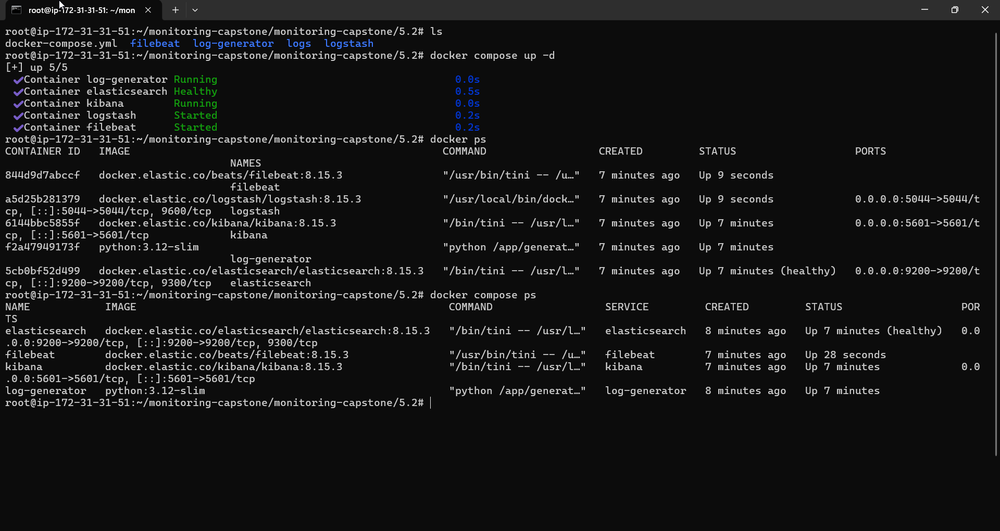
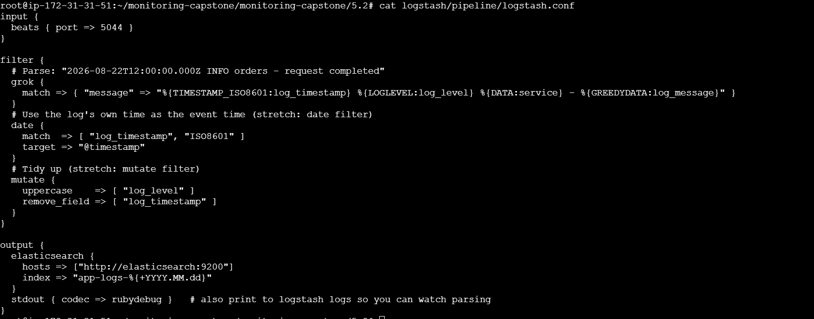
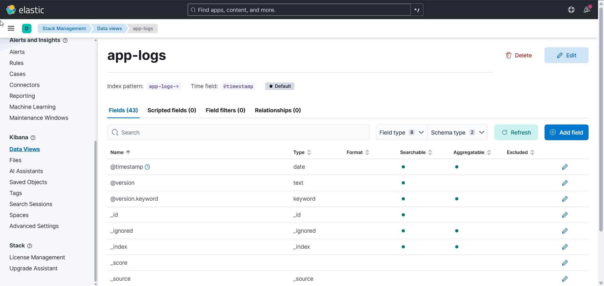
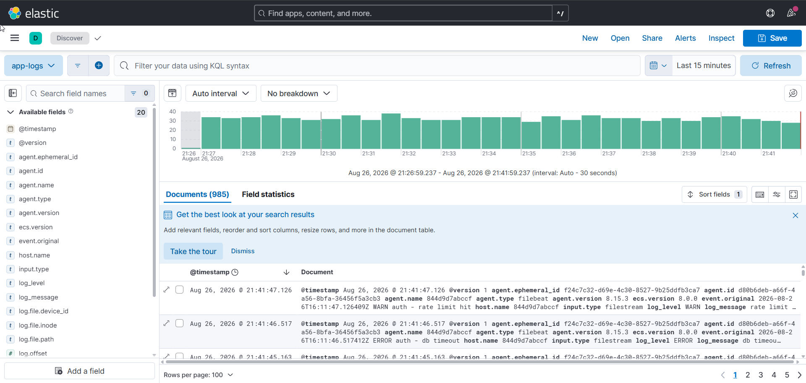
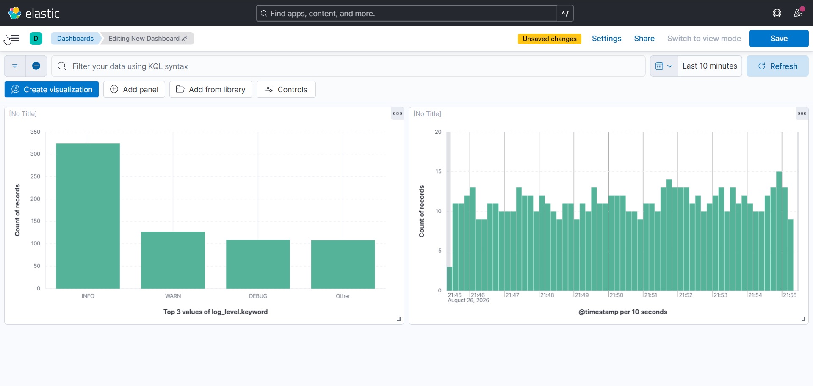

# Monitoring Capstone — Section 5

A production-style **observability platform** built from the ground up in Docker, on a single
AWS EC2 host (Ubuntu 22.04, `m7i-flex.large` — 2 vCPU / 8 GB). It covers the three pillars of
observability — **metrics, logs, traces** — plus **alerting** and a **Thanos scaling layer**,
delivered as four progressive sub-projects and a unified end-to-end stack.

| # | Project | Stack | Produces |
|---|---------|-------|----------|
| **5.1** | Comprehensive Monitoring | Prometheus · Grafana · Node Exporter · cAdvisor | Live metrics + custom dashboards |
| **5.2** | Centralized Logging | Elasticsearch · Logstash · Kibana · Filebeat | Searchable, parsed logs + visualizations |
| **5.3** | Advanced Monitoring | Prometheus rules · Alertmanager · Jaeger | Alerts to Slack + distributed traces |
| **5.4** | Scaling | Federation · Thanos · MinIO · Grafana | Durable, global, HA monitoring |
| **e2e** | Unified platform | All of the above, profile-gated | One `docker compose up` demo |

Each sub-project maps 1:1 to the SkillfyMe manual (Overview → Tools → Architecture → Workflow →
6 Tasks → Expected Outcome → Deliverables) and includes the manual's **"Beyond the Basics"** stretch goals.

- **Deep architecture & interview notes:** [`docs/ARCHITECTURE.md`](docs/ARCHITECTURE.md)
  (request-lifecycle walkthroughs, component reference, failure modes, 25+ Q&A).
- **Provisioning & firewall:** [`docs/AWS-SETUP.md`](docs/AWS-SETUP.md).

## Repo layout

```
monitoring/
├── project-5.1-prometheus-grafana/   # 5.1 metrics stack
├── project-5.2-ELK-stack/                              # 5.2 ELK logging stack
├── project-5.3-Alerts-Tracing/                             # 5.3 alerting + tracing
├── project-5.4-scaling-monitoring/                            # 5.4 Thanos scaling
├── e2e/                           # unified, profile-gated platform (metrics|logging|alerting|tracing|scaling|all)
├── docs/                        # ARCHITECTURE.md, AWS-SETUP.md, BUILD-GUIDE.md, DELIVERABLES.md
└── screenshots/                # deliverable screenshots (shown below)
```

## How to run (one project at a time — RAM)

```bash
cd project-5.1-prometheus-grafana && docker compose up -d     # then 5.2 / 5.3 / 5.4
docker compose ps                                             # wait for healthy
docker compose down -v                                        # tear down before the next
```
For the unified stack: `cd e2e && cp .env.example .env && make up-metrics` (or `up-all`) — see
[`e2e/README.md`](e2e/README.md) for profiles and per-profile RAM costs.

---

# Deliverables

Screenshots captured on the live EC2 instance. Each is mapped to the manual's required deliverable.

## Project 5.1 — Prometheus + Grafana

Prometheus scrapes node-exporter, cAdvisor, and itself; Grafana visualizes the metrics.

**Stack up (Compose):**


**Prometheus targets — all scrape targets UP:**


**Grafana → Prometheus data source ("Successfully queried the Prometheus API"):**


**Grafana dashboards — imported Node Exporter dashboard and a custom host dashboard:**


**Container metrics via cAdvisor in Prometheus, and a stretch alert rule (`HighCpuUsage`):**


## Project 5.2 — ELK Centralized Logging

Filebeat tails a log file → Logstash parses it (grok + date) → Elasticsearch indexes it → Kibana searches it.

**ELK stack up (Elasticsearch healthy, Logstash/Kibana/Filebeat running):**


**Logstash pipeline — grok extracts fields, date sets `@timestamp`, output to `app-logs-*`:**


**Kibana data view `app-logs-*` (time field `@timestamp`) and parsed logs in Discover:**



**Kibana dashboard — log volume over time and counts by `log_level.keyword`:**


## Project 5.3 — Alerting + Distributed Tracing

> **Manual deliverables:** (1) Prometheus rules UI with recording + alerting rules in "UP" state,
> (2) an alert notification received in a channel (Slack), (3) Jaeger UI trace with multiple spans.

**① Prometheus Rules UI — recording + alerting rules loaded and healthy (`OK`):**


Supporting — the `HighErrorRate` alert actually **FIRING** on the Alerts page:


**② Alert delivered to Slack** (`High 5xx error rate for job flaky-app … 18.67% 5xx … for over 2 minutes`):


**③ Jaeger UI — a `frontend /dispatch` trace with 40 spans across 6 services:**


**Beyond the Basics** — Jaeger's own metrics integrated into Prometheus (the `jaeger:14269` target is UP):


## Project 5.4 — Scaling with Thanos

> **Manual deliverables:** (1) Thanos Query UI with stores/components connected and healthy,
> (2) a Grafana dashboard querying (via Thanos) data from two different leaf Prometheus instances,
> (3) a diagram of the final scaled architecture.

**① Thanos Query "Stores" — both sidecars (`region=us-east` / `eu-west`, `replica=A`) and the Store, all UP:**


**② Grafana querying via Thanos — one query returns `up` from both leaves (`region=us-east` and `eu-west`):**


**③ Final scaled architecture** (full write-up in [`docs/ARCHITECTURE.md`](docs/ARCHITECTURE.md) §2.4):

```
 prometheus-us (region=us-east)     prometheus-eu (region=eu-west)
   local compaction OFF               local compaction OFF
        │ sidecar uploads 2h blocks        │ sidecar uploads 2h blocks
        └───────────────┬──────────────────┘
                        ▼
                   MinIO  (S3 bucket "thanos")
                    ▲          ▲
         reads blocks│          │reads/compacts
                ┌─────┴────┐  ┌──┴───────────┐
                │ Thanos   │  │ Thanos       │
                │ Store    │  │ Compact(--wait)
                └─────┬────┘  └──────────────┘
   sidecars (fresh)   │  store (history)
        └──────────┬──┴───────────┐
                   ▼               (dedup replica label)
             Thanos Query  ────────────────▶  Grafana
        (global view: both regions + history)

 (a federation master is also included purely to contrast the classic
  scaling approach against the Thanos object-storage path.)
```

---

## The unified e2e stack (bonus)

`e2e/` runs everything together in one Compose project, gated by **profiles**
(`metrics`, `logging`, `alerting`, `tracing`, `scaling`, `all`), behind **one Grafana** with
provisioned data sources (Prometheus, Thanos, Elasticsearch) and dashboards-as-code. It adds a
`Makefile` (`make up-metrics` … `up-all`, `verify`, `nuke`) and a `verify.sh` smoke test that checks
targets, rules, ES health, the logs index, Grafana, the Thanos stores, and a Jaeger trace. See
[`e2e/README.md`](e2e/README.md).

## Ports and secrets

- **Security-group ports** (per project): 5.1 → `9090, 3000, 9100, 8080`; 5.2 → `5601, 9200`;
  5.3 → `9090, 9093, 16686, 8080`; 5.4 → `10902, 3000, 9001`.
- **Secrets** live in a git-ignored `.env` (`SLACK_WEBHOOK_URL`, `GRAFANA_ADMIN_PASSWORD`,
  `MINIO_ROOT_PASSWORD`, `ELASTIC_PASSWORD`) and are referenced from compose as `${VAR}` — never committed.
- All image tags are **pinned** (no `:latest`).
