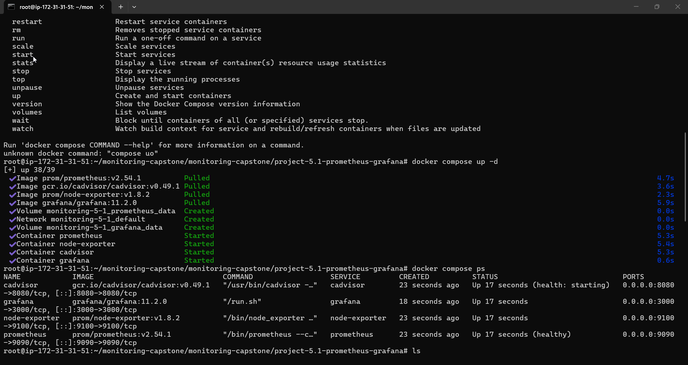
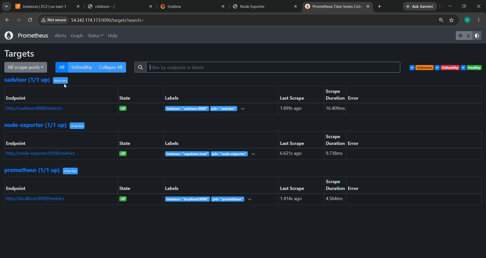
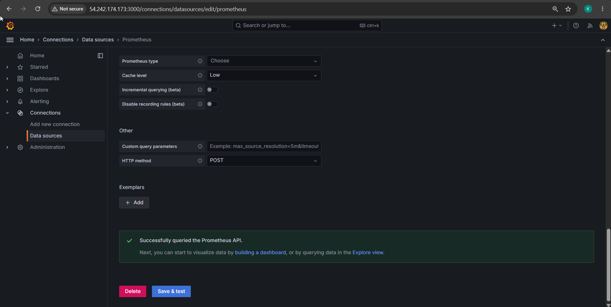
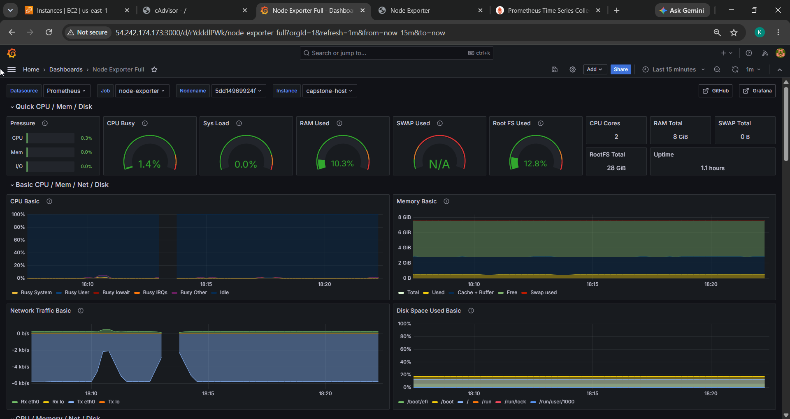
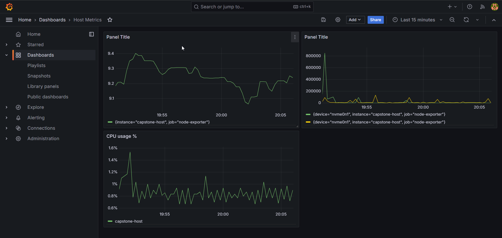
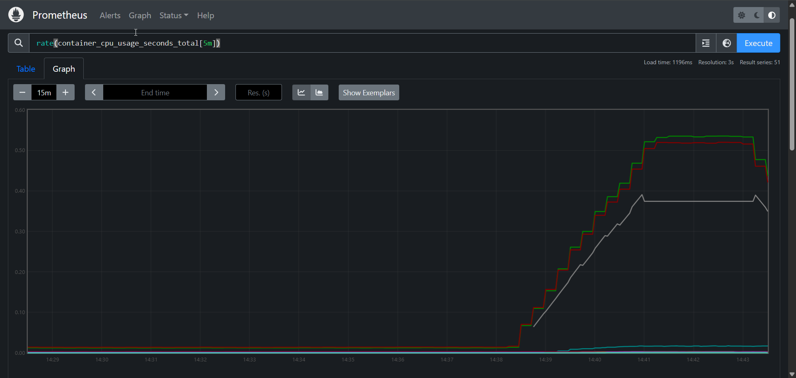
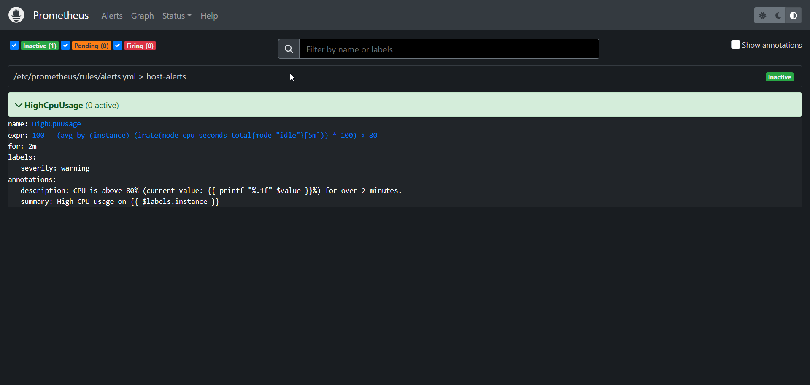

# Project 5.1 — Comprehensive Monitoring with Prometheus & Grafana

Deploy a metrics stack: **Prometheus** scrapes the host (node-exporter), containers
(cAdvisor), and itself; **Grafana** visualizes it with provisioned data sources and dashboards.

```
 node-exporter :9100 ─┐
 cAdvisor      :8080 ─┼─ scrape 15s ─▶ Prometheus :9090 ─▶ Grafana :3000
 prometheus    :9090 ─┘                    │ TSDB (15d)
```

## Folder layout

```
project-5.1-prometheus-grafana/
├── docker-compose.yml                     # prometheus, node-exporter, cadvisor, grafana
├── prometheus/
│   ├── prometheus.yml                     # scrape config (self, node-exporter, cadvisor)
│   └── rules/alerts.yml                   # stretch: HighCpuUsage alert rule
└── grafana/
    ├── provisioning/                      # auto-wired datasource + dashboard provider
    └── dashboards/*.json                  # Node Exporter Full (1860) + custom node metrics
```

## Run

```bash
docker compose up -d
docker compose ps            # wait until healthy
# UIs: Grafana http://EC2_IP:3000 (admin/admin)  ·  Prometheus http://EC2_IP:9090
docker compose down -v       # tear down before the next project
```

## Ports to open in the security group

`3000` Grafana · `9090` Prometheus · `9100` node-exporter · `8080` cAdvisor.

## Deliverables

**Stack up:**


**Prometheus — all scrape targets UP:**


**Grafana → Prometheus data source ("Successfully queried the Prometheus API"):**


**Grafana dashboards — imported Node Exporter + custom host dashboard:**



**Container metrics via cAdvisor, and the stretch alert rule (`HighCpuUsage`):**



## Notes

- Image tags are pinned (Prometheus `v2.54.1`, Grafana `11.2.0`, node-exporter `v1.8.2`,
  cAdvisor `v0.49.1`) — never `:latest`.
- Data sources and dashboards are **provisioned from disk**, not clicked through the UI.
- **Beyond the Basics:** container metrics with cAdvisor and a `HighCpuUsage` alert rule
  (alerting is wired to Alertmanager/Slack in project 5.3).
