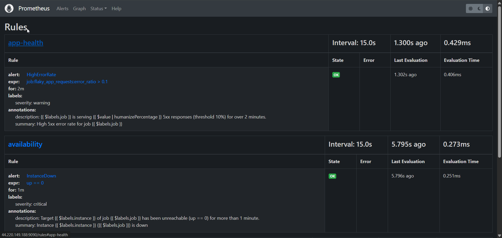
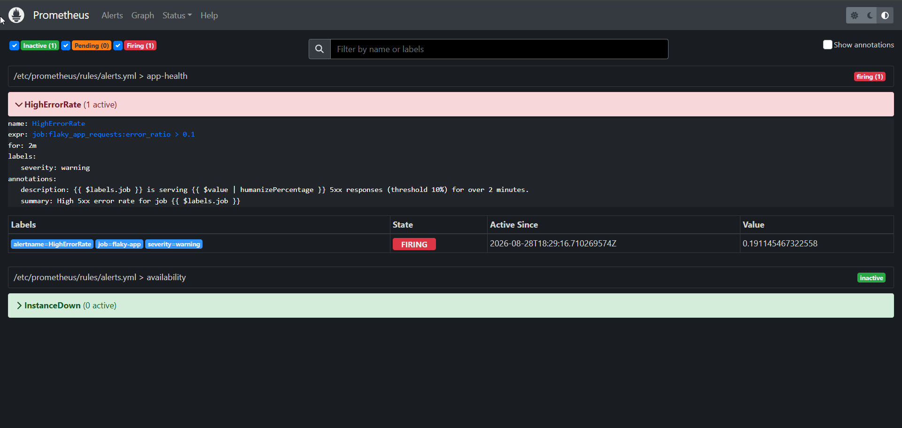
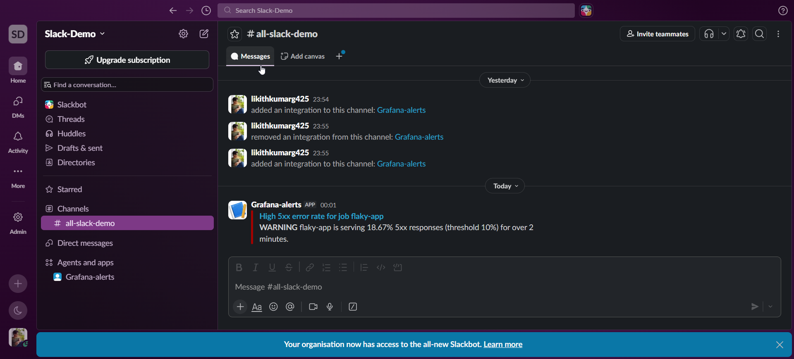
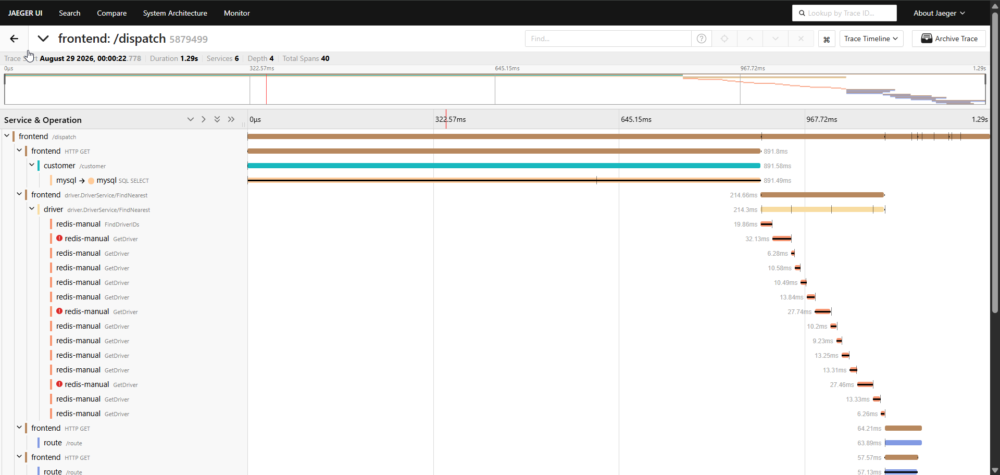
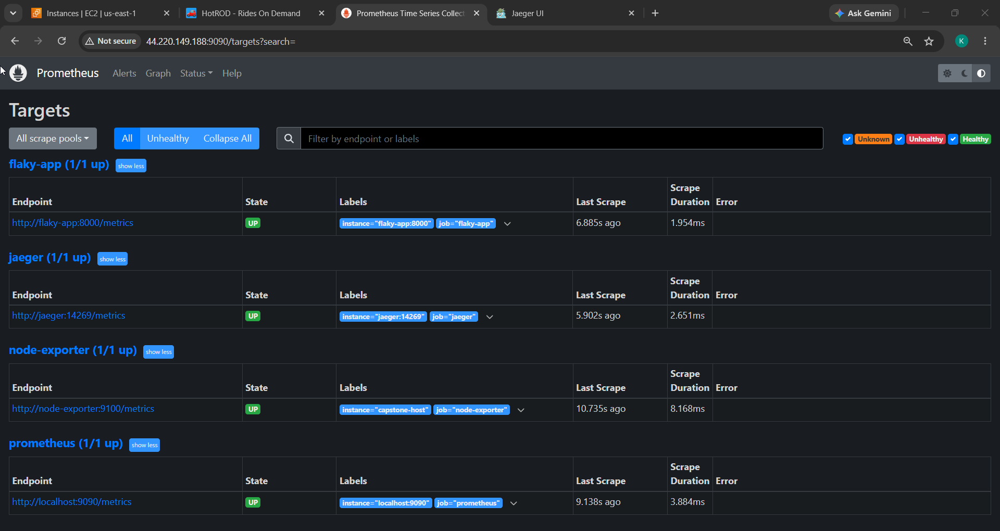

# Project 5.3 — Advanced Monitoring: Alerting & Distributed Tracing

Extends Prometheus with **recording rules** and **alerting rules**, routes alerts through
**Alertmanager** to **Slack**, and adds **Jaeger** for distributed tracing (with the HotROD demo app).

```
 Prometheus ─eval rules─▶ ALERTS ─push─▶ Alertmanager ─group/inhibit/route─▶ Slack
 HotROD ──OTLP/HTTP :4318──▶ Jaeger all-in-one ──▶ Jaeger UI :16686
 Prometheus also scrapes Jaeger's own metrics on :14269
```

## Folder layout

```
project-5.3-Alerts-Tracing/
├── docker-compose.yml                 # prometheus, alertmanager, node-exporter, flaky-app, jaeger, hotrod
├── prometheus/
│   ├── prometheus.yml                 # scrapes self, node-exporter, flaky-app, jaeger:14269; points at Alertmanager
│   └── rules/
│       ├── recording.yml              # instance:node_cpu:busy_percent, job:flaky_app_requests:error_ratio
│       └── alerts.yml                 # InstanceDown (critical), HighErrorRate (warning)
├── alertmanager/alertmanager.yml      # route + Slack receiver + inhibition (critical suppresses warning)
└── flaky-app/                         # tiny Python app, ~20% 5xx, exposes /metrics on :8000
```

## Run

```bash
# put your Slack Incoming Webhook in a git-ignored .env first:
echo 'SLACK_WEBHOOK_URL=https://hooks.slack.com/services/XXX/YYY/ZZZ' > .env
docker compose up -d --build
docker compose ps            # wait until prometheus + alertmanager are healthy
```

Generate traces (needed for the Jaeger deliverable): open `http://EC2_IP:8080` and click the
HotROD **customer** buttons a few times. Wait ~2–3 min for `HighErrorRate` to fire → Slack.

## Ports to open in the security group

`9090` Prometheus · `9093` Alertmanager · `16686` Jaeger UI · `8080` HotROD.

## Deliverables (map to the manual)

**① Prometheus Rules UI — recording + alerting rules loaded and healthy (`OK`):**


Supporting — `HighErrorRate` actually **FIRING**:


**② Alert delivered to Slack:**


**③ Jaeger UI — `frontend /dispatch` trace, 40 spans across 6 services:**


**Beyond the Basics** — Jaeger's own metrics scraped by Prometheus (`jaeger:14269` target UP):


## Notes

- Pinned tags (Prometheus `v2.54.1`, Alertmanager `v0.27.0`, Jaeger `1.57`).
- **Secret handling:** Alertmanager can't expand env vars in its config, so `${SLACK_WEBHOOK_URL}`
  is `sed`-substituted into a runtime copy at container start — the webhook never lives in a tracked file.
- **Recording rules** precompute the CPU-busy and error-ratio series so alerts/dashboards read one
  cheap series. **`for:`** (1m / 2m) is the pending period that filters transient blips.
- Jaeger all-in-one keeps traces in memory (demo only). `COLLECTOR_OTLP_ENABLED=true` opens OTLP;
  HotROD exports via `OTEL_EXPORTER_OTLP_ENDPOINT=http://jaeger:4318`.
