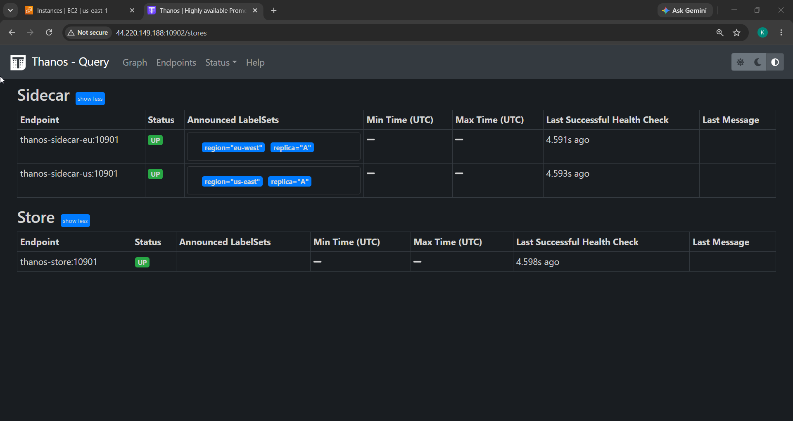
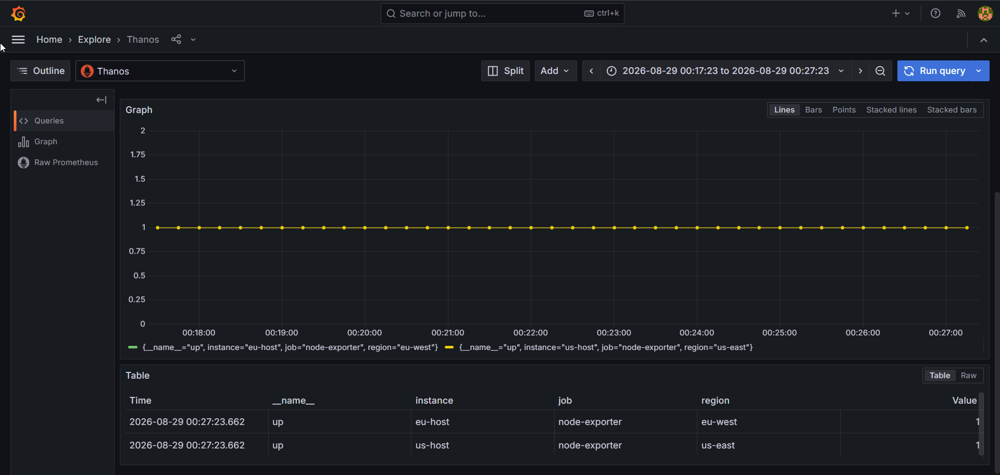

# Project 5.4 — Scaling Monitoring Infrastructure with Thanos

Turn many short-lived Prometheus instances into one **global, durable** query surface using
**Thanos** + **MinIO** (S3). Two region-labelled leaf Prometheis upload blocks to object storage;
Thanos Query fans out across them and dedups replicas. A federation master is included **only to
contrast** the classic scaling approach.

```
 prometheus-us (region=us-east)   prometheus-eu (region=eu-west)   [local compaction OFF]
        │ sidecar uploads 2h blocks      │ sidecar uploads 2h blocks
        └──────────────┬─────────────────┘
                       ▼
                    MinIO (S3 bucket "thanos")
                    ▲            ▲
             ┌──────┴────┐   ┌───┴──────────────┐
             │ Thanos    │   │ Thanos Compact   │
             │ Store     │   │ (--wait)         │
             └──────┬────┘   └──────────────────┘
   sidecars(fresh)  │ store(history)
        └────────┬──┴──────▶ Thanos Query :10902 ──(dedup replica)──▶ Grafana :3000
                 │
        prometheus-fed :9091  ── /federate on both leaves (CONTRAST path, not Thanos)
```

## Folder layout

```
project-5.4-scaling-monitoring/
├── docker-compose.yml                 # minio(+init), 2 node-exporters, 2 leaves, fed master, 2 sidecars, store, compact, query, grafana
├── prometheus-us/prometheus.yml       # external_labels {region: us-east, replica: A}
├── prometheus-eu/prometheus.yml       # external_labels {region: eu-west, replica: A}
├── prometheus-fed/prometheus.yml      # scrapes /federate on both leaves (contrast only)
├── thanos/objstore.yml                # S3 config pointing at MinIO
└── grafana/provisioning/datasources/thanos.yml   # Grafana → Thanos Query
```

## Run

```bash
docker compose up -d
sleep 30
docker compose ps            # thanos-store & thanos-compact must be "running", not restarting
```

## Ports to open in the security group

`10902` Thanos Query · `3000` Grafana · `9000`/`9001` MinIO API/console.

## Deliverables (map to the manual)

**① Thanos Query "Stores" — both sidecars (`region=us-east`/`eu-west`, `replica=A`) + Store, all UP:**


**② Grafana querying via Thanos — one `up` query returns data from both leaves (both regions):**


**③ Final scaled architecture** — the ASCII diagram above (full write-up in `../docs/ARCHITECTURE.md` §2.4).

## Notes — the one detail that's easy to get wrong

- Each leaf runs `--storage.tsdb.min-block-duration=2h --storage.tsdb.max-block-duration=2h` to
  **disable local compaction**. The sidecar uploads raw 2h blocks and **Thanos Compact** owns
  compaction globally. If a leaf compacted locally it would rewrite already-uploaded blocks →
  **overlapping blocks** in the bucket → Thanos Compact **halts**. Exactly **one** compactor per bucket.
- Thanos Store/Compact run as `user: "0:0"` because named volumes are root-owned but the image runs
  as `nobody` (otherwise `mkdir data-dir: permission denied`).
- **`external_labels`** (`region`, `replica`) are what let Thanos distinguish leaves and dedup HA
  replicas (`--query.replica-label=replica`).
- Pinned tags (Thanos `v0.36.1`, MinIO `RELEASE.2024-09-13T20-26-02Z`). MinIO dev creds are inline
  here; the e2e stack generates `objstore.yml` from `.env` at runtime instead.
